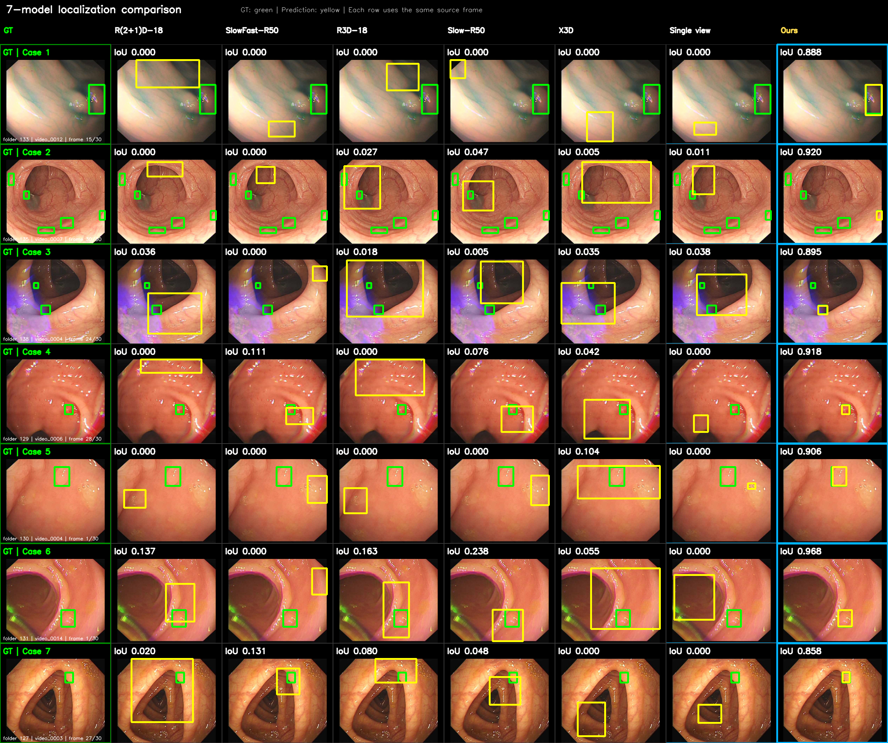

# WSPolypNet

Research code and model weights for weakly supervised polyp localization in colonoscopy videos. The main pipeline combines an ROI-trained **X3D-M** classifier, five-view class activation evidence, and **MedSAM2** temporal segmentation to produce frame-level polyp bounding boxes from video-level supervision.

> The medical video datasets are **not distributed** in this repository. Users must obtain the data under the terms of the original dataset provider and prepare the directory structure described below.

## Method overview

The adopted localization pipeline is implemented in [`overall_best_pipeline.py`](overall_best_pipeline.py):

1. Detect a folder-level endoscopic field of view (FOV), mask every pixel outside the FOV to exact zero, and place the complete FOV on a 224×224 canvas without aspect distortion.
2. Run X3D-M on the full canvas and four overlapping 144×144 corner crops.
3. Project the four crop evidence maps back to the full canvas and apply pixel-wise maximum fusion.
4. Select the frame with the strongest fused evidence and extract five spatially separated CAM peaks using NMS.
5. Prompt MedSAM2 from each candidate point and propagate the candidate masks bidirectionally through the video.
6. Score the candidate tracks using X3D evidence. Keep the top-1 track unless an alternative exceeds it by 20%.
7. If the selected temporal mask is missing, empty, or has frame-level propagation confidence below 0.755, replace only that frame with an independent MedSAM2 point-prompt prediction.
8. Convert the final mask to a bounding box and evaluate frame-level IoU/CorLoc.

The default method uses five views. Pass `--single-view` to evaluate the ablation using only the full 224×224 view.

## Pipeline visualization



The complete 14-stage visualization for one example is available in [`figures/pipeline/`](figures/pipeline/README.md), including the full input, four crops, per-view CAMs, fused CAM, selected frame, selected point, and final MedSAM2 bounding boxes.

## Repository structure

```text
WSPolypNet/
├── overall_best_pipeline.py              # X3D + MedSAM2 single/five-view evaluation
├── standalone_localization_eval.py       # self-contained localization reference
├── evaluate_middle_segment.py            # five-backbone CAM evaluation
├── evaluate_video_classification.py      # video classification evaluation
├── summarize_corloc_by_polyp_size.py     # small/large polyp breakdown
├── generate_multiview_pipeline_diagnostics.py
├── generate_seven_model_iou_grid.py
├── Slow-R50/
├── SlowFast-R50/
├── R3D-18/
├── R(2+1)D-18/
├── X3D/                                  # adopted backbone
├── datasets/roi_manifest.json            # shared FOV/ROI geometry
├── external/MedSAM2/README.md            # MedSAM2 setup instructions
├── figures/
└── weights/README.md                      # checkpoint inventory and checksums
```

Each backbone directory contains the model definition, dataset/ROI implementation, training script, CAM evaluator, ROI audit tools, and the selected inference checkpoint.

## Environment

The experiments were run with Python, PyTorch 2.6, CUDA 12.4, and an NVIDIA GPU. MedSAM2 evaluation requires CUDA.

```bash
conda create -n wspolypnet python=3.10 -y
conda activate wspolypnet

# Select the PyTorch command appropriate for your CUDA installation.
pip install torch==2.6.0 torchvision==0.21.0
pip install -r requirements.txt
```

Model-specific dependency snapshots are also included as `<model>/requirements.txt`.

## MedSAM2 setup

MedSAM2 is a third-party dependency and is not vendored here:

```bash
git clone https://github.com/bowang-lab/MedSAM2.git external/MedSAM2
mkdir -p external/MedSAM2/checkpoints
wget -O external/MedSAM2/checkpoints/MedSAM2_latest.pt \
  https://huggingface.co/wanglab/MedSAM2/resolve/main/MedSAM2_latest.pt
```

See [`external/MedSAM2/README.md`](external/MedSAM2/README.md) for the expected checkpoint checksum and layout.

## Dataset layout

The code expects numeric subfolders and complete videos as samples:

```text
datasets/
├── TrainVaild(video)_without_polyp/
│   ├── 1/*.mp4
│   └── ...
├── TrainValid(video)_with_polyp/
│   ├── 1/*.mp4
│   └── ...
├── ValidationData/
│   ├── video/<folder>/*.mp4
│   └── annotation/<folder>/*.txt
└── roi_manifest.json
```

Each validation annotation text file contains a box count on the first line followed by `x1 y1 x2 y2` boxes. Annotation files are assigned sequentially to decoded video frames within each numeric folder. See [`datasets/README.md`](datasets/README.md) for details.

## ROI preprocessing

All backbones use the same implementation in `<model>/codes/roi.py` and the same [`datasets/roi_manifest.json`](datasets/roi_manifest.json).

- Pixels outside the complete FOV hull are set to exactly zero.
- Aspect ratio is preserved when placing the FOV on the 224×224 canvas.
- Training randomly scales the complete FOV from 0.90–1.00 and randomly places it at a valid canvas position; horizontal flipping is enabled.
- Evaluation uses scale 1.00 and a deterministic centered position.
- No content is cropped from the detected FOV.
- Checkpoints record the ROI manifest SHA-256 and reject a mismatched manifest.

To rebuild the manifest for a different local dataset:

```bash
python X3D/codes/build_roi_manifest.py --help
python X3D/codes/audit_validation_roi.py --help
```

## Training

The same interface is provided for all five backbones. For example:

```bash
python X3D/codes/train.py \
  --negative-root 'datasets/TrainVaild(video)_without_polyp' \
  --positive-root 'datasets/TrainValid(video)_with_polyp' \
  --validation-root datasets/ValidationData \
  --roi-manifest datasets/roi_manifest.json \
  --epochs 50 \
  --freeze-epochs 10 \
  --lr 1e-4 \
  --weight-decay 0.01
```

Replace `X3D` with `Slow-R50`, `SlowFast-R50`, `R3D-18`, or `R(2+1)D-18` to train another backbone.

The public checkpoints are inference-only exports: optimizer, scheduler, and scaler states were intentionally removed. They support evaluation and model initialization but not exact optimizer-state resume.

## Evaluation

### CAM-only backbone evaluation

```bash
python X3D/codes/evaluate.py X3D/Checkpoints/epoch_014.pth \
  --validation-root datasets/ValidationData \
  --roi-manifest datasets/roi_manifest.json \
  --cam-threshold 0.5
```

### X3D + MedSAM2 five-view evaluation

```bash
python overall_best_pipeline.py \
  --x3d-checkpoint X3D/Checkpoints/epoch_014.pth \
  --medsam-repository external/MedSAM2 \
  --medsam-checkpoint external/MedSAM2/checkpoints/MedSAM2_latest.pt \
  --validation-root datasets/ValidationData \
  --roi-manifest datasets/roi_manifest.json \
  --output-dir outputs/x3d_medsam2_five_view
```

For the single-view ablation, add `--single-view` and choose a separate output directory. Use `--resume` to continue an interrupted evaluation directory.

### Pipeline diagnostics

After producing `per_frame_corloc.csv`:

```bash
python generate_multiview_pipeline_diagnostics.py \
  --result-csv outputs/x3d_medsam2_five_view/per_frame_corloc.csv \
  --output-dir outputs/pipeline_diagnostics \
  --count 5
```

This exports 14 stage images per selected 30-frame video.

## Evaluation protocol

- IoU is the maximum overlap between the predicted box and any GT box in that frame.
- CorLoc@0.3, @0.5, and @0.7 are reported over annotated frames.
- For size analysis, GT boxes are mapped to the 224×224 evaluation canvas. A frame is **small** when the largest GT box occupies at most 5% of the canvas and **large** when it occupies more than 5%.

### Middle validation subset results

| Method | Mean IoU | CorLoc@0.3 | CorLoc@0.5 | CorLoc@0.7 |
|---|---:|---:|---:|---:|
| Slow-R50, single-view CAM | 0.1376 | 0.1894 | 0.0787 | 0.0106 |
| SlowFast-R50, single-view CAM | 0.1148 | 0.1358 | 0.0364 | 0.0060 |
| R3D-18, single-view CAM | 0.1255 | 0.1675 | 0.0654 | 0.0083 |
| R(2+1)D-18, single-view CAM | 0.0909 | 0.1273 | 0.0278 | 0.0012 |
| X3D-M, single-view CAM | 0.1422 | 0.2104 | 0.0932 | 0.0163 |
| X3D-M + MedSAM2, single-view | 0.2903 | 0.3687 | 0.3372 | 0.2794 |
| **X3D-M + MedSAM2, five-view** | **0.3555** | **0.4548** | **0.4200** | **0.3362** |

Machine-readable values, including the small/large-polyp breakdown, are provided in [`results/middle_validation_summary.json`](results/middle_validation_summary.json).

The qualitative comparison figure intentionally selects examples where five-view fusion clearly improves localization. It is illustrative rather than an unbiased replacement for the complete quantitative evaluation.

## Reproducibility notes

- Seed used by the training scripts: `2026`.
- Whole videos are processed with batch size 1 to preserve variable temporal length.
- Kinetics normalization: mean `(0.45, 0.45, 0.45)`, standard deviation `(0.225, 0.225, 0.225)`.
- Five-view crops: full 224×224 plus four 144×144 corner crops at offsets `(0,0)`, `(80,0)`, `(0,80)`, and `(80,80)`.
- CAM smoothing sigma: `4.0`; NMS candidates: `5`; minimum peak distance: `16` pixels.
- Track alternative margin: `20%`; frame-wise fallback threshold: `0.755`.

## Data and privacy

No source videos, annotations, patient metadata, training logs, caches, or raw prediction tables are included. Figures contain only de-identified endoscopic frames selected for method illustration. Verify that your dataset license and institutional approvals permit publication of derived figures before redistribution.

## Citation

If you use this code or the released weights, please cite the accompanying WSPolypNet paper. The final bibliographic entry will be added after publication.
